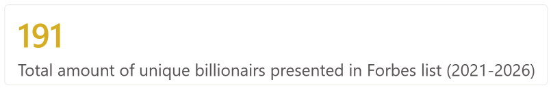

# Research on Russian billionaires wealth (2021-2026)

Add description and the rest of visualizations

**Power BI´pbix file:** [Download](./billionairs_dashboard.pbix)

---

## List of visualizations

### 1. Total amount of unique billionaires presented in Forbes list between 2021 and 2026
On this KPI card indicated 

### 2. Dynamic of a net worth of selected person
On this line chart presented 

### 3. Comparison of a dynamic of a net worth among various person
On this line chart presented 

### 4. Number of entrances in Forbes list
This  pie chart demonstrates

### 5. Total net worth amount all billionaires by year
This line chart

### 6. Total amount of billionaires by year
This  bar chart

### 7. % of contribution of top 15 billionaires to the total annual net worth amount by year
This  bar chart

### 8. Proportion of billionaires by number of children.png
This  area chart

### 9. Number of children
This group of KPI´s indicates 

