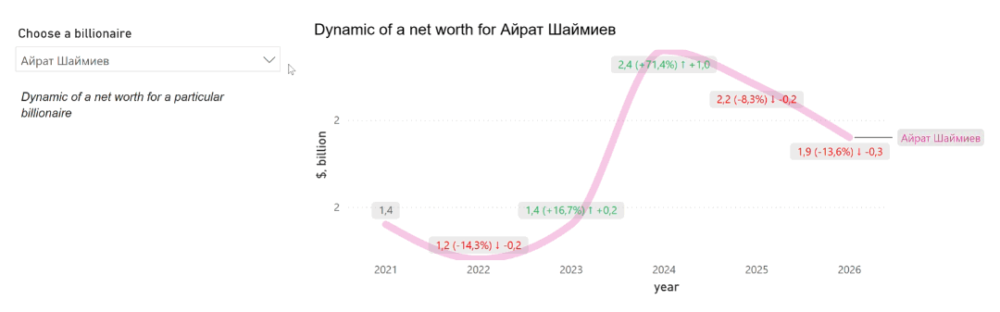
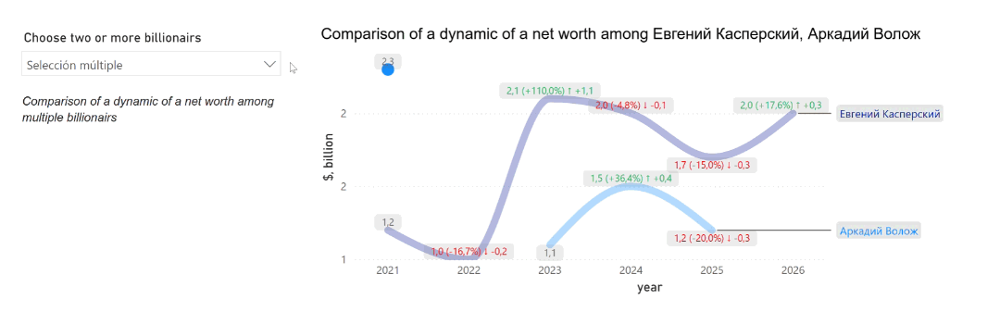
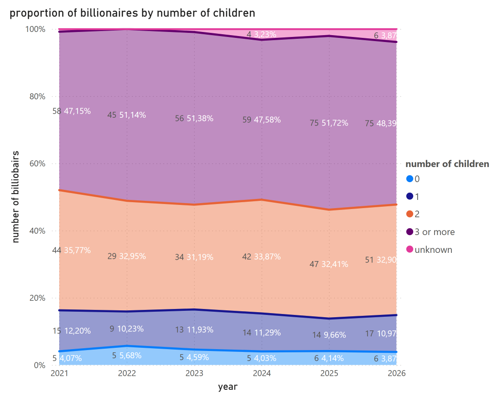
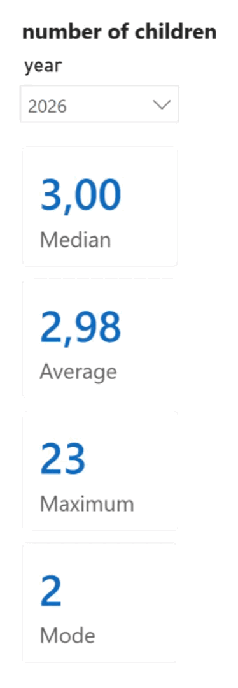

# Research on Russian billionaires wealth (2021-2026)

Краткое введение. Какую задачу решает этот дашборд, откуда взяты данные (источник) и какие выводы были сделаны.

**Power BI´pbix file:** [Download](./billionairs_dashboard.pbix)

---

## Visualisations

### 1. Total amount of unique billionairs presented in Forbes list between 2021 and 2026

### 2. Dynamic of a net worth of selected person

**Descripion:** На этом графике представлена динамика выручки по месяцам. Главный инсайт: в декабре 

### 3. Comparison of a dynamic of a net worth

**Descripion:** На этом графике представлена динамика выручки по месяцам. Главный инсайт: в декабре 

### 4. Number of entrancies in Forbes list

**Descripion:** На этом графике представлена динамика выручки по месяцам. Главный инсайт: в декабре 

### 5. Total net worth amount all billionairs by year

**Descripion:** На этом графике представлена динамика выручки по месяцам. Главный инсайт: в декабре 

### 6. Total amount of billionairs by year

**Descripion:** На этом графике представлена динамика выручки по месяцам. Главный инсайт: в декабре 

### 7. % of contribution of top 15 billionairs to the total annual net worth amount by year

**Descripion:** На этом графике представлена динамика выручки по месяцам. Главный инсайт: в декабре 

### 8. Proportion of billionaires by number of children.png

**Descripion:** На этом графике представлена динамика выручки по месяцам. Главный инсайт: в декабре 

### 9. Proportion of billionaires by number of children

**Descripion:** На этом графике представлена динамика выручки по месяцам. Главный инсайт: в декабре 

