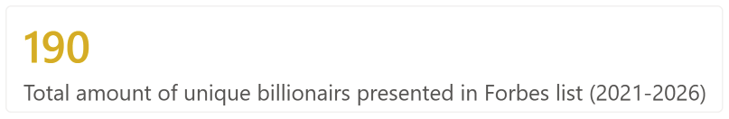
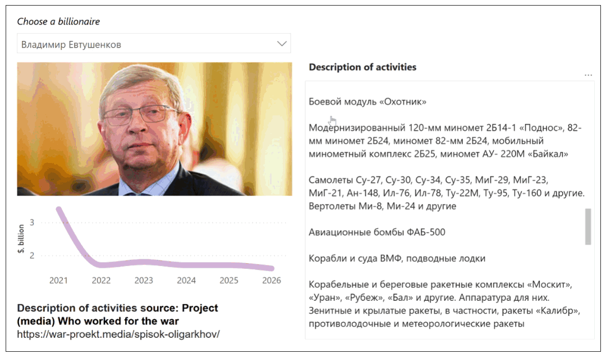
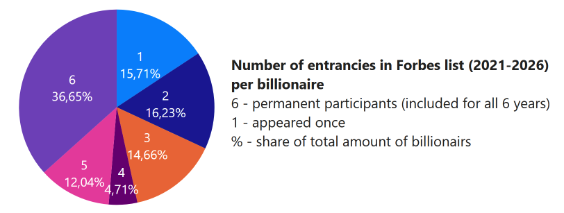
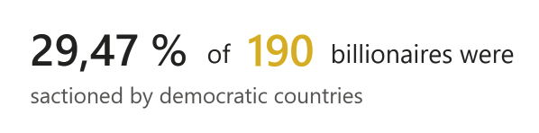
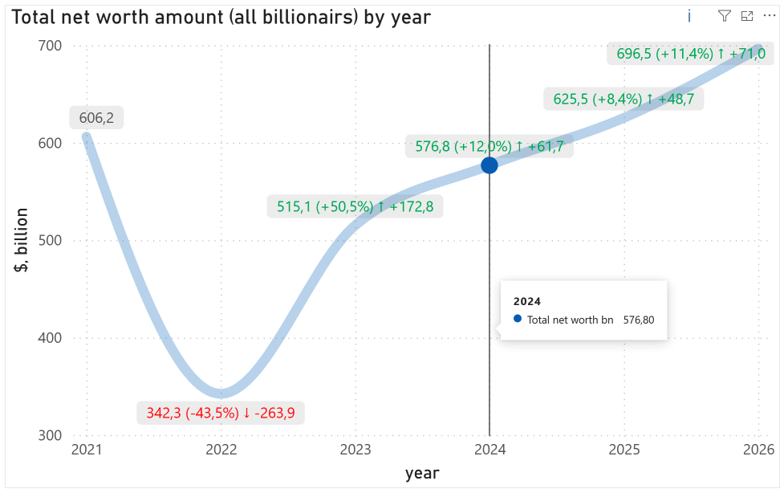
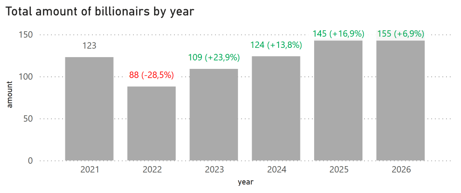
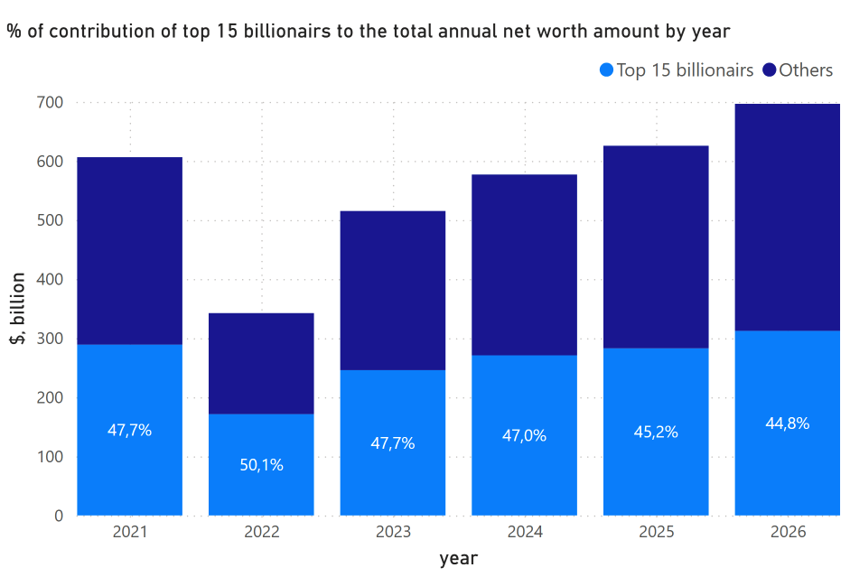

# Research on Russian billionaires wealth (2021-2026)

Data about net worth, family and marital status was parced from Russian Forbes website annual wealth list for the years starting from 2021 and ending in 2026.
Only individuals whose net worth was equal to or exceeded $1 billion at the time of inclusion in the list were selected.

**.pbix for Power BI** [Download](./billionairs_dashboard.pbix)

---

## List of visualizations

### 1. Total amount of unique billionaires presented in Forbes list between 2021 and 2026
On this KPI card indicated sum of all individuals 

### 2. Dynamic of a net worth of selected person
This line chart shows how person's net worth during the period under consideration
* Text labels combine the current value, percentage difference to the previous period, and absolute deviation from the previous period in one line. When a metric is declining, the text is colored red with a marker (↓), when it is increasing, it is colored green (↑), and when there is no change, it is colored  gray.

### 3. Comparison of a dynamic of a net worth among various person
On this line chart it is possible to choose two or more individuals for comparison of a net worth
* Text labels combine the current value, percentage difference to the previous period, and absolute deviation from the previous period in one line. When a metric is declining, the text is colored red with a marker (↓), when it is increasing, it is colored green (↑), and when there is no change, it is colored  gray.

### 4. Detailed information about persons included in investigation by Project (media) "Who Worked for the War"

https://war-proekt.media/spisok-oligarkhov/provider/

### 5. Number of entrances in Forbes list
This  pie chart demonstrates how many times/years was each billionaire appeared in annual top wealth list 

### 6. % of sanctioned by democratic countries

### 7. Total net worth amount all billionaires by year
This line chart shows how has the total amount of capital owned by individuals with a net worth of over $1 billion changed by year
* Text labels combine the current value, percentage difference to the previous period, and absolute deviation from the previous period in one line. When a metric is declining, the text is colored red with a marker (↓), when it is increasing, it is colored green (↑), and when there is no change, it is colored  gray.

### 8. Total amount of billionaires by year
This  bar chart the number of people on the list each year

### 9. % of contribution of top 15 billionaires to the total annual net worth amount by year
This  bar chart indicates how top 15 individuals by net worth form total annual net worth amount by year

### 10. Proportion of billionaires by number of children.png
This  area chart indicates the absolute number of individuals included in each group by the number of children and the share of this group in the overall structure

### 11. Number of children
This group of KPI´s indicates average number of children, median number of children, mode and maximum number of children for the period selected in the filter among all individuals included in annually billionaires list

